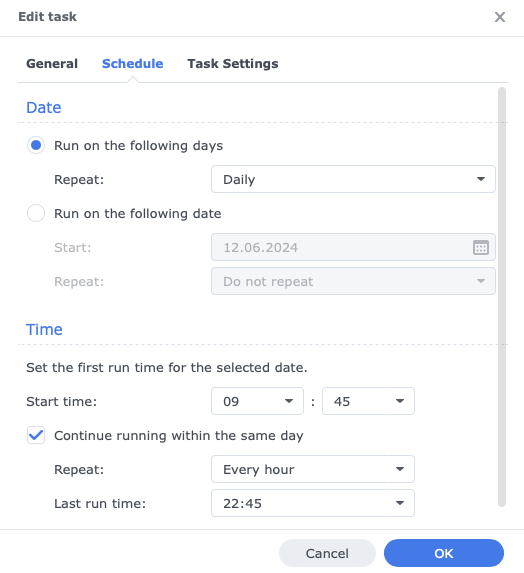

# Docker Database Container Backup

This script allows a consistent backup of a Docker database container. It can be scheduled via Crontab or other tools like Synology Task Scheduler (see below). The advantage of a database dump over a copy in the file system is the consistency of the data, even if the container has not been stopped.

Just edit the values for `keep_days` and `backupdir` in the script to your personal needs and configure it to be run automatically. The scritp also crates logfiles next to the backup storage location which can be used for troubleshooting.

## Using Cron

Edit your crontab using `crontab -e` and enter the following line at the end of the file. Don't forget to update `/paht/to/` to the correct storage location of your script.

`30 * * * * /path/to/backup.sh`

Depending of the way you run your database container, you man need to setup the crontab for root.

For further information regarding corntabs visit [crontab.guru](https://crontab.guru).

## Using Synology Task Scheduler

## Other scripts

If you only have either MySQL/MariaDB or Postgres database containers running, you can also use the scripts in the [other](./other/) folder.